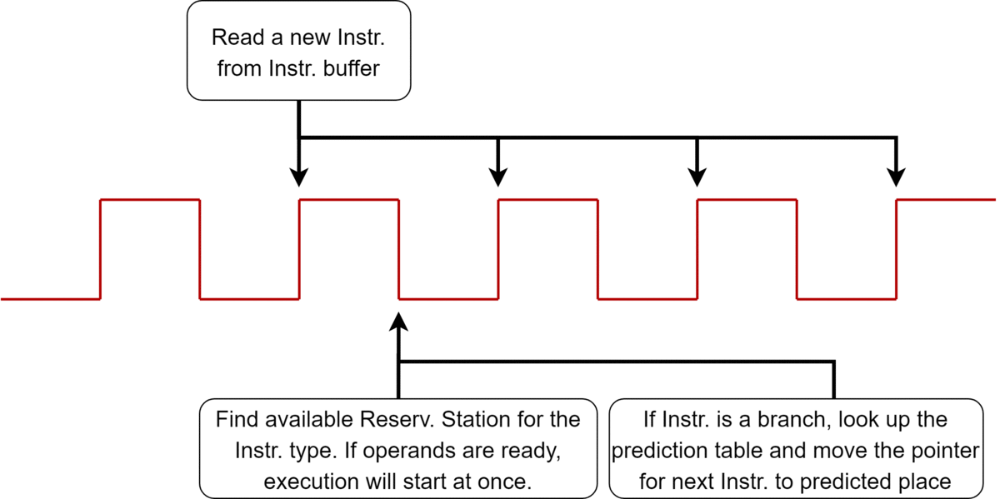
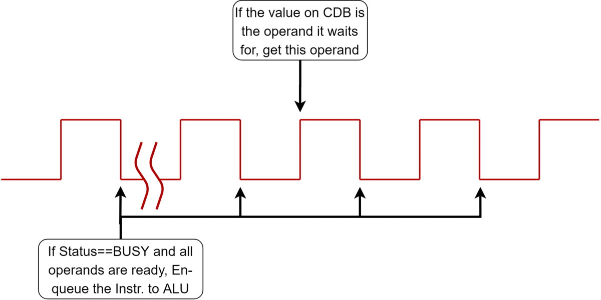

# A pthread implementation
- This program simulates the behaviour of an MIPS CPU running `Tomasulo algorithm`, and outputs a table recording the start-time of stages in each instruction's lifetime (i.e. `issue`, `execution`, `write_back`...).
- The code is written in a `parallel` way, which means, every virtual-component is functioning in an independent thread, and all threads comply a universal clock, which is also a thread.
- The code is written in a "Quasi-VHDL" style, so you can use function *`at_rising_edge`* and *`at_falling_edge`* to sync each component with the universal clock, but don't forget to register the component in *`clk_wait_list`* first  
  
# How to use it on Windows
This program can be compiled on both Windows (needs Mingw32 or any GNU for Windows installed) and Linux. But if you want to run it on Windows without compilation, simply download the zip file in [release](https://github.com/Ziang95/Tomasulo_simulator/releases), and use any shell on Windows like `cmd.exe` or `powershell.exe` to run the mips.exe. Here is the procedure: 
1. Prepare an input file containing the CPU configuration, initial registor/memory values and assembly code. here is a [template](https://github.com/Ziang95/Tomasulo_simulator/blob/master/InputTest.txt). As for the instruction type, currently only `ADD`, `ADDI`, `ADD.D`, `SUB`, `SUB.D`, `MUL.D`, `LD`, `SD`, `BNE`, `BEQ` and `NOP` are supported. 
2. Put your file into the same folder with `mips.exe`, then open `cmd.exe` and cd to the folder, or **press shift**->**right click** your mouse at blank region in the folder->Open `PowerShell` Window here.
3. In the shell window, for example, type: ".\mips.exe .\test_case\case1.txt 3" Here, the program takes in 2 arguments, the first is the path of input file, the second is a number *debug_level (optional)*, which control how many debug outputs you want to see on screen. 

<!-- If you've done everything correctly, you can get output like this:  -->
<!--  -->

# How does each component work
We know in real CPUs there are many clock signals (Internal/External clock) generated by oscillators, all components work **step-by-step** and **parallelly** as these clock signals tick. To simulate it, this program lets each component (Function unit, Issue unit, Memory etc.) run in an independent thread, and each component is actually a finite state machine driven by the unique clock signal. For example: 
## The Issue unit
Every instruction needs to be issued before it goes to reservation station:  
At every `rising edge` of the universal clock, Issue unit decodes an instruction. 
At every `falling edge` of the universal clock, Issue unit load the decoded instruction to the reservation.  
But whenever a wrong branch prediction is revealed, the Issue unit will stop decoding instructions and switch to a freezed state until the wrong prediction is resolved.

## Reservation stations for every Function unit:
As mentioned above, reservation stations are loaded at `falling edges`. Note that 2 conditions may happen here: 
1. Operands are ready. 
2. Some operands are not ready (e.g. they are results from previous calculations). 

In case 1, instructions will be sent to functions unit queues at the same time when reservation stations are loaded (`falling edges`).  In case 2, reservation station will listen to the Common Data Bus (CDB) and try to retrieve the operand at every `rising edge`, if operands are ready, executions will be launched at the next `falling edge`. 
On the other hand, if the execution is already launched, then the reservation station will listen to the CDB and try to retrieve the result at every `rising edge`, if the result is acquired, instruction will be conveyed to the Commit unit, the status of reservation station will be set `IDLE` at the next `rising edge`.

## Task queues
Note that all function units (int adders, float-point multipliers etc.) inherite from the "function unit" class, so they have their own priority queue for upcoming jobs. Additionally, since the length of assembly code is not specified, these queues are also designed to be circular to avoid bugs.