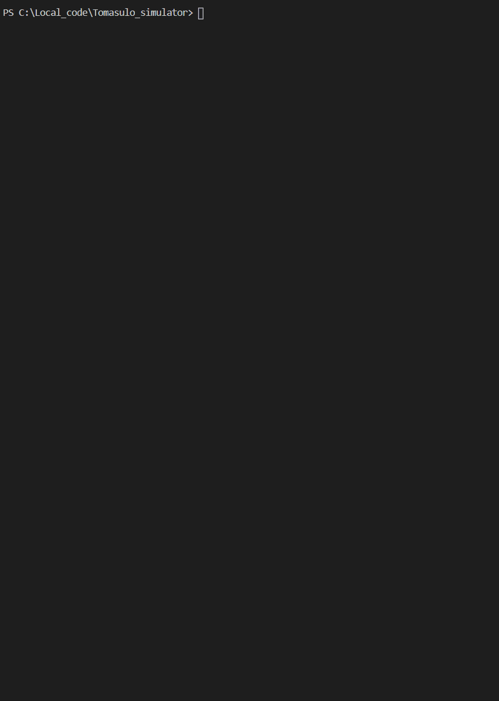

# A pthread-win32 implementation
- This program simulates the behaviour of an MIPS CPU running `Tomasulo algorithm`, and outputs a table recording the start-time of stages in each instruction's lifetime (i.e. `issue`, `execution`, `write_back`...).
- The code is written in a `parallel` way, which means, every virtual-component is functioning in an independent thread, and all threads comply a universal clock, which is also a thread.
- The code is written in a "Quasi-VHDL" style, so you can use function *`at_rising_edge`* and *`at_falling_edge`* to sync each component with the universal clock, but don't forget to register the component in *`clk_wait_list`* first  
  
## How to use it
For now, this program can run on Windows and can possibly be compiled on Linux (not tested yet). Simply download the zip file in [release](https://github.com/Ziang95/Tomasulo_simulator/releases), and use any shell on Windows like `cmd.exe` or `powershell.exe` to run the mips.exe. Here is the procedure: 
1. Prepare an input file containing the CPU configuration, initial registor/memory values and assembly code. here is a [template](https://github.com/Ziang95/Tomasulo_simulator/blob/master/InputTest.txt). As for the instruction type, currently only `ADD`, `ADDI`, `ADD.D`, `SUB`, `SUB.D`, `MUL.D`, `LD`, `SD`, `BNE`, `BEQ` and `NOP` are supported. 
2. Put your file into the same folder with `mips.exe`, then open `cmd.exe` and cd to the folder, or **press shift**->**right click** your mouse at blank region in the folder->Open `PowerShell` Window here.
3. In the shell window, for example, type: ".\mips.exe .\test_case\case1.txt 3" Here, the program takes in 2 arguments, the first is the path of input file, the second is a number *debug_level (optional)*, which control how many debug outputs you want to see on screen. 

If you've done everything correctly, you can get output like this: 

Enjoy~❤️